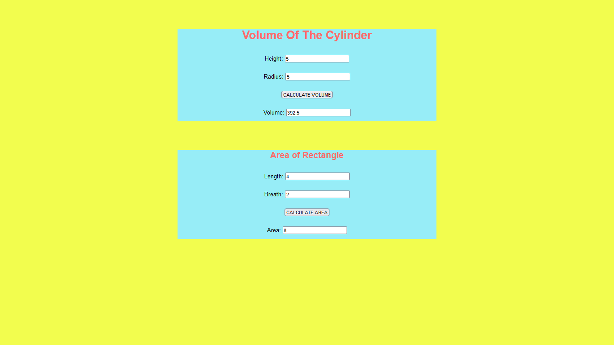

# Web Page for Mathematical Calculations

## AIM:

To design a static website with validation to perform mathematical calculations in client side.

## DESIGN STEPS:

### Step 1:

Requirement collection.

### Step 2:

Creating the layout using HTML and CSS.

### Step 3:

Write javascript to perform the calculations.

### Step 4:

Include regularexpression based input validation.

### Step 5:

Validate the layout in various browsers.

### Step 6:

Validate the HTML code.

### Step 6:

Publish the website in the given URL.

## PROGRAM :

--include your code--
```
<!DOCTYPE html>
<html lang="en">
  <head>
    <meta charset="UTF-8" />
    <meta http-equiv="X-UA-Compatible" content="IE=edge" />
    <meta name="viewport" content="width=device-width, initial-scale=1.0" />
    <title>Mathematical Calculations</title>
    <style>
      * {
      box-sizing: border-box;
      font-family:Arial, Helvetica, sans-serif;
      }
      body {
      background-color: rgb(242, 253, 78);
      }
      .container {
      width: 720px;
      margin-left: auto;
      margin-right: auto;
      }
      .content {
      display: block;
      width: 100%;
      background-color: #97edf7;
      margin-top: 80px;
      min-height: 200px;
      }
      h1{
          text-align: center;
          margin-top: ;
          color: rgb(252, 106, 106);
      }
      h2{
          text-align: center;
          margin-top: ;
          color: rgb(252, 106, 106);
      }
      .formelement{
          text-align: center;
  
          line-height: 50px;
      }
      </style>
  </head>
  <body>
      <div class="container">
           <div class="content">
               <h1>Volume Of The Cylinder</h1>
               <form>
                   <div class="formelement">
                       <label for="aedit">Height:</label>
                       <input type="text" id="aedit" value="0"/>
                   </div>
                   <div class="formelement">  
                       <label for="bedit">Radius:</label>
                       <input type="text" id="bedit" value="0"/>
                   </div>
                   <div class="formelement">
                       <input type="button" value="CALCULATE VOLUME" id="addbutton"/>
                   </div>
                   <div class="formelement">
                       <label for="cedit">Volume:</label>
                       <input type="text" id="cedit" value="0"/>
                   </div>
               </form>
           </div>
      </div>
  <script type="text/javascript">
      var button;
      button=document.querySelector("#addbutton");
      button.addEventListener("click",function(){
          var atext,btext,ctext;
          var aval,bval,cval;
          atext=document.querySelector("#aedit");
          btext=document.querySelector("#bedit");
          ctext=document.querySelector("#cedit");
      
          aval=parseInt(atext.value);
          bval=parseInt(btext.value);
          cval=3.14*(aval**2)*bval;
          ctext.value=""+cval;
      });
  </script>
      <div class="container">
        <div class="content">
            <h2>Area of Rectangle</h2>
            <form>
                <div class="formelement">
                    <label for="dedit">Length:</label>
                    <input type="text" id="dedit" value="0"/>
                </div>
                <div class="formelement">  
                    <label for="eedit">Breath:</label>
                    <input type="text" id="eedit" value="0"/>
                </div>
                <div class="formelement">
                    <input type="button" value="CALCULATE AREA" id="button"/>
                </div>
                <div class="formelement">
                    <label for="fedit">Area:</label>
                    <input type="text" id="fedit" value="0"/>
                </div>
            </form>
        </div>
   </div>
<script type="text/javascript">
   var button;
   button=document.querySelector("#button");
   button.addEventListener("click",function(){
       var dtext,etext,ftext;
       var dval,eval,fval;
       dtext=document.querySelector("#dedit");
       etext=document.querySelector("#eedit");
       ftext=document.querySelector("#fedit");
   
       dval=parseInt(dtext.value);
       eval=parseInt(etext.value);
       fval=dval*eval;
       ftext.value=""+fval;
   });
</script>

  </body>
  </html>
 ```

## OUTPUT:



## Result:

Thus a website is designed to perform mathematical calculations in the client side.
